# Auditra ERP - Enhanced Entity-Relationship (EER) Diagram

## Overview

This document describes the complete database schema for the Auditra Auditing & Valuation ERP system. The database is built on Django 5.0 with PostgreSQL and consists of **22 entities** across **5 Django apps**.

---

## Entity-Relationship Diagram (Mermaid)

```mermaid
erDiagram

    %% ===========================
    %% CORE: Django Auth User
    %% ===========================
    User {
        int id PK
        varchar username UK
        varchar first_name
        varchar last_name
        varchar email
        varchar password
        bool is_staff
        bool is_active
        bool is_superuser
        datetime date_joined
        datetime last_login
    }

    %% ===========================
    %% AUTHENTICATION APP
    %% ===========================
    UserRole {
        int id PK
        int user_id FK,UK
        varchar role
        int assigned_by_id FK
        datetime assigned_at
        datetime created_at
        bool password_changed
        decimal custom_salary
    }

    PasswordResetOTP {
        int id PK
        varchar email
        varchar otp
        datetime created_at
        datetime expires_at
        bool is_verified
    }

    PaymentSlip {
        int id PK
        int user_id FK
        int month
        int year
        decimal salary
        decimal allowances
        decimal epf_contribution
        decimal overtime_hours
        bool overtime_hours_uploaded
        decimal overtime_pay
        decimal net_salary
        varchar role
        varchar role_display
        varchar pay_slip_number UK
        varchar employee_number
        varchar status
        bool is_uploaded
        int generated_by_id FK
        datetime generated_at
        datetime uploaded_at
        datetime paid_at
    }

    ClientFormSubmission {
        int id PK
        varchar first_name
        varchar last_name
        varchar email
        text address
        varchar phone
        varchar nic
        varchar company_name
        varchar project_title
        text project_description
        varchar agent_name
        varchar agent_phone
        varchar agent_email
        varchar status
        datetime submitted_at
        datetime reviewed_at
        text notes
        int reviewed_by_id FK
        int coordinator_id FK
        datetime assigned_at
        varchar coordinator_response
        text rejection_reason
        datetime responded_at
        bool project_created
    }

    CoordinatorAssignment {
        int id PK
        int submission_id FK
        int coordinator_id FK
        int assigned_by_id FK
        varchar status
        text rejection_reason
        datetime assigned_at
        datetime responded_at
    }

    EmployeeFormSubmission {
        int id PK
        varchar first_name
        varchar last_name
        varchar email
        text address
        varchar phone
        date birthday
        varchar nic
        file cv
        varchar status
        datetime submitted_at
        datetime reviewed_at
        text notes
        int reviewed_by_id FK
    }

    LeaveRequest {
        int id PK
        int user_id FK
        varchar leave_type
        date start_date
        date end_date
        text reason
        varchar status
        datetime submitted_at
        datetime reviewed_at
        int reviewed_by_id FK
        text notes
    }

    EmployeeRemovalRequest {
        int id PK
        int user_id FK
        int requested_by_id FK
        text reason
        varchar status
        int reviewed_by_id FK
        datetime reviewed_at
        text admin_notes
        datetime created_at
        datetime updated_at
    }

    %% ===========================
    %% PROJECTS APP
    %% ===========================
    Project {
        int id PK
        varchar title
        text description
        varchar priority
        int coordinator_id FK
        int assigned_field_officer_id FK
        int assigned_client_id FK
        int assigned_agent_id FK
        int assigned_accessor_id FK
        int assigned_senior_valuer_id FK
        bool has_agent
        json client_info
        json agent_info
        varchar status
        varchar workflow_stage
        date start_date
        date end_date
        varchar md_gm_approval_status
        text md_gm_rejection_reason
        datetime md_gm_approved_at
        datetime md_gm_rejected_at
        varchar admin_approval_status
        text admin_rejection_reason
        int admin_approved_by_id FK
        datetime admin_approved_at
        datetime admin_rejected_at
        decimal estimated_value
        bool payment_completed
        datetime created_at
        datetime updated_at
    }

    ProjectDocument {
        int id PK
        int project_id FK
        file file
        varchar name
        text description
        int uploaded_by_id FK
        int assigned_to_id FK
        datetime uploaded_at
    }

    ProjectStatusHistory {
        int id PK
        int project_id FK
        varchar status
        varchar stage
        text notes
        int created_by_id FK
        datetime created_at
    }

    ProjectPayment {
        int id PK
        int project_id FK,UK
        decimal estimated_value
        varchar payment_status
        file bank_slip
        datetime bank_slip_uploaded_at
        int bank_slip_uploaded_by_id FK
        datetime payment_requested_at
        int payment_requested_by_id FK
        datetime payment_approved_at
        int payment_approved_by_id FK
        text payment_rejection_reason
        int payment_rejection_count
        datetime last_rejected_at
        text coordinator_notes
        text client_notes
        text payment_instructions
        decimal agent_payment_amount
        varchar agent_payment_status
        datetime agent_paid_at
        int agent_paid_by_id FK
        text agent_payment_notes
        datetime created_at
        datetime updated_at
    }

    ProjectCancellationRequest {
        int id PK
        int project_id FK
        int requested_by_id FK
        text reason
        varchar status
        int reviewed_by_id FK
        text admin_remarks
        datetime reviewed_at
        datetime created_at
        datetime updated_at
    }

    CommissionReport {
        int id PK
        int project_id FK
        int generated_by_id FK
        int agent_id FK
        file report_file
        decimal commission_amount
        bool sent_to_agent
        datetime sent_at
        datetime created_at
    }

    %% ===========================
    %% ATTENDANCE APP
    %% ===========================
    Holiday {
        int id PK
        varchar name
        date date UK
        bool is_active
        datetime created_at
    }

    Attendance {
        int id PK
        int user_id FK
        date date
        datetime check_in
        datetime check_out
        datetime overtime_start
        datetime overtime_end
        varchar status
        decimal working_hours
        decimal overtime_hours
        text notes
        datetime created_at
        datetime updated_at
    }

    %% ===========================
    %% VALUATIONS APP
    %% ===========================
    Valuation {
        int id PK
        int project_id FK
        int field_officer_id FK
        varchar category
        varchar status
        text description
        decimal estimated_value
        text notes
        decimal land_area
        varchar land_type
        varchar land_location
        decimal land_latitude
        decimal land_longitude
        decimal building_area
        varchar building_type
        varchar building_location
        decimal building_latitude
        decimal building_longitude
        int number_of_floors
        int year_built
        varchar vehicle_make
        varchar vehicle_model
        int vehicle_year
        varchar vehicle_registration_number
        int vehicle_mileage
        varchar vehicle_condition
        varchar other_type
        text other_specifications
        text rejection_reason
        text accessor_comments
        file submitted_report
        text senior_valuer_comments
        file final_report
        text md_gm_comments
        datetime created_at
        datetime updated_at
        datetime submitted_at
    }

    ValuationPhoto {
        int id PK
        int valuation_id FK
        image photo
        varchar caption
        datetime uploaded_at
    }

    Notification {
        int id PK
        int user_id FK
        varchar title
        text message
        varchar notification_type
        bool is_read
        int valuation_id FK
        int project_id FK
        datetime created_at
    }

    ValuationHistory {
        int id PK
        int valuation_id FK
        varchar action
        int performed_by_id FK
        text comments
        datetime created_at
    }

    %% ===========================
    %% SYSTEM LOGS APP
    %% ===========================
    SystemLog {
        int id PK
        int block_index UK
        varchar action
        varchar category
        int user_id FK
        int target_user_id FK
        text description
        varchar ip_address
        json metadata
        datetime timestamp
        varchar previous_hash
        varchar current_hash
    }

    %% ======================================
    %% RELATIONSHIPS
    %% ======================================

    %% Authentication App
    User ||--|| UserRole : "has"
    User ||--o{ PaymentSlip : "receives"
    User ||--o{ LeaveRequest : "submits"
    User ||--o{ EmployeeRemovalRequest : "targeted for removal"
    User ||--o{ ClientFormSubmission : "reviews"
    User ||--o{ CoordinatorAssignment : "assigned as coordinator"
    User ||--o{ EmployeeFormSubmission : "reviews"

    UserRole }o--|| User : "assigned_by"
    PaymentSlip }o--|| User : "generated_by"
    LeaveRequest }o--|| User : "reviewed_by"
    EmployeeRemovalRequest }o--|| User : "requested_by"
    EmployeeRemovalRequest }o--|| User : "reviewed_by"
    ClientFormSubmission }o--|| User : "coordinator"
    CoordinatorAssignment }o--|| ClientFormSubmission : "belongs to"
    CoordinatorAssignment }o--|| User : "assigned_by"

    %% Projects App
    User ||--o{ Project : "coordinates"
    Project }o--|| User : "assigned_field_officer"
    Project }o--|| User : "assigned_client"
    Project }o--|| User : "assigned_agent"
    Project }o--|| User : "assigned_accessor"
    Project }o--|| User : "assigned_senior_valuer"
    Project }o--|| User : "admin_approved_by"

    Project ||--o{ ProjectDocument : "has"
    Project ||--o{ ProjectStatusHistory : "tracks"
    Project ||--|| ProjectPayment : "has"
    Project ||--o{ ProjectCancellationRequest : "may have"
    Project ||--o{ CommissionReport : "generates"

    ProjectDocument }o--|| User : "uploaded_by"
    ProjectDocument }o--|| User : "assigned_to"
    ProjectStatusHistory }o--|| User : "created_by"
    ProjectPayment }o--|| User : "bank_slip_uploaded_by"
    ProjectPayment }o--|| User : "payment_requested_by"
    ProjectPayment }o--|| User : "payment_approved_by"
    ProjectPayment }o--|| User : "agent_paid_by"
    ProjectCancellationRequest }o--|| User : "requested_by"
    ProjectCancellationRequest }o--|| User : "reviewed_by"
    CommissionReport }o--|| User : "generated_by"
    CommissionReport }o--|| User : "agent"

    %% Attendance App
    User ||--o{ Attendance : "records"

    %% Valuations App
    Project ||--o{ Valuation : "has"
    User ||--o{ Valuation : "submits as field_officer"
    Valuation ||--o{ ValuationPhoto : "has"
    Valuation ||--o{ ValuationHistory : "tracks"
    Valuation ||--o{ Notification : "triggers"
    Project ||--o{ Notification : "triggers"
    User ||--o{ Notification : "receives"
    ValuationHistory }o--|| User : "performed_by"

    %% System Logs App
    User ||--o{ SystemLog : "performs action"
    SystemLog }o--|| User : "target_user"
```



---

## Entities by App

### 1. Django Built-in: `auth_user`

| Field          | Type         | Constraints      |
|----------------|-------------|------------------|
| id             | Integer     | PK, Auto         |
| username       | Varchar(150)| Unique, Not Null |
| first_name     | Varchar(150)|                  |
| last_name      | Varchar(150)|                  |
| email          | Varchar(254)|                  |
| password       | Varchar(128)| Not Null         |
| is_staff       | Boolean     | Default: False   |
| is_active      | Boolean     | Default: True    |
| is_superuser   | Boolean     | Default: False   |
| date_joined    | DateTime    | Auto             |
| last_login     | DateTime    | Nullable         |

Central entity. All role-based users (Admin, Coordinator, Field Officer, Accessor, Senior Valuer, MD/GM, HR Head, General Employee, Client, Agent) are stored here and differentiated via the `UserRole` table.

---

### 2. Authentication App (`authentication`)

#### UserRole (`user_roles`)

| Field            | Type          | Constraints                  |
|------------------|--------------|------------------------------|
| id               | Integer      | PK, Auto                     |
| user_id          | Integer      | FK -> User, OneToOne, Unique |
| role             | Varchar(50)  | Choices (11 roles)           |
| assigned_by_id   | Integer      | FK -> User, Nullable         |
| assigned_at      | DateTime     | Auto                         |
| created_at       | DateTime     | Auto                         |
| password_changed | Boolean      | Default: True                |
| custom_salary    | Decimal(10,2)| Nullable                     |

**Role choices:** admin, coordinator, field_officer, accessor, senior_valuer, md_gm, hr_head, general_employee, client, agent, unassigned

#### PasswordResetOTP (`password_reset_otp`)

| Field       | Type         | Constraints      |
|-------------|-------------|------------------|
| id          | Integer     | PK, Auto         |
| email       | Email       | Not Null         |
| otp         | Varchar(6)  | Not Null         |
| created_at  | DateTime    | Auto             |
| expires_at  | DateTime    | Not Null         |
| is_verified | Boolean     | Default: False   |

#### PaymentSlip (`payment_slips`)

| Field                  | Type          | Constraints                         |
|------------------------|--------------|-------------------------------------|
| id                     | Integer      | PK, Auto                            |
| user_id                | Integer      | FK -> User                          |
| month                  | Integer      | 1-12                                |
| year                   | Integer      |                                     |
| salary                 | Decimal(10,2)| Basic salary                        |
| allowances             | Decimal(10,2)| Default: 0.00                       |
| epf_contribution       | Decimal(10,2)| 8% of basic salary                  |
| overtime_hours         | Decimal(5,2) | Default: 0.00                       |
| overtime_hours_uploaded | Boolean     | Default: False                      |
| overtime_pay           | Decimal(10,2)| Default: 0.00                       |
| net_salary             | Decimal(10,2)| salary - EPF + allowances + overtime|
| role                   | Varchar(50)  | Denormalized role                   |
| role_display           | Varchar(100) | Denormalized role display name      |
| pay_slip_number        | Varchar(50)  | Unique, e.g. PS-202601-5            |
| employee_number        | Varchar(50)  | User ID as string                   |
| status                 | Varchar(20)  | pending / generated / paid          |
| is_uploaded            | Boolean      | Default: False                      |
| generated_by_id        | Integer      | FK -> User, Nullable                |
| generated_at           | DateTime     | Auto                                |
| uploaded_at            | DateTime     | Nullable                            |
| paid_at                | DateTime     | Nullable                            |

**Unique constraint:** (user_id, month, year)

#### ClientFormSubmission (`client_form_submissions`)

| Field                  | Type         | Constraints              |
|------------------------|-------------|--------------------------|
| id                     | Integer     | PK, Auto                 |
| first_name             | Varchar(100)| Nullable                 |
| last_name              | Varchar(100)| Nullable                 |
| email                  | Email       | Not Null                 |
| address                | Text        | Nullable                 |
| phone                  | Varchar(20) | Nullable                 |
| nic                    | Varchar(20) | Nullable                 |
| company_name           | Varchar(200)| Nullable                 |
| project_title          | Varchar(200)| Not Null                 |
| project_description    | Text        | Not Null                 |
| agent_name             | Varchar(200)| Nullable                 |
| agent_phone            | Varchar(20) | Nullable                 |
| agent_email            | Email       | Nullable                 |
| status                 | Varchar(20) | pending/reviewed/assigned/approved/rejected |
| submitted_at           | DateTime    | Auto                     |
| reviewed_at            | DateTime    | Nullable                 |
| notes                  | Text        | Nullable                 |
| reviewed_by_id         | Integer     | FK -> User, Nullable     |
| coordinator_id         | Integer     | FK -> User, Nullable     |
| assigned_at            | DateTime    | Nullable                 |
| coordinator_response   | Varchar(20) | pending/accepted/rejected|
| rejection_reason       | Text        | Nullable                 |
| responded_at           | DateTime    | Nullable                 |
| project_created        | Boolean     | Default: False           |

#### CoordinatorAssignment (`coordinator_assignments`)

| Field              | Type         | Constraints              |
|--------------------|-------------|--------------------------|
| id                 | Integer     | PK, Auto                 |
| submission_id      | Integer     | FK -> ClientFormSubmission|
| coordinator_id     | Integer     | FK -> User               |
| assigned_by_id     | Integer     | FK -> User, Nullable     |
| status             | Varchar(20) | pending/accepted/rejected|
| rejection_reason   | Text        | Nullable                 |
| assigned_at        | DateTime    | Auto                     |
| responded_at       | DateTime    | Nullable                 |

#### EmployeeFormSubmission (`employee_form_submissions`)

| Field          | Type         | Constraints              |
|----------------|-------------|--------------------------|
| id             | Integer     | PK, Auto                 |
| first_name     | Varchar(100)| Nullable                 |
| last_name      | Varchar(100)| Nullable                 |
| email          | Email       | Nullable                 |
| address        | Text        | Nullable                 |
| phone          | Varchar(20) | Nullable                 |
| birthday       | Date        | Not Null                 |
| nic            | Varchar(20) | Nullable                 |
| cv             | FileField   | Nullable                 |
| status         | Varchar(20) | pending/reviewed/approved/rejected |
| submitted_at   | DateTime    | Auto                     |
| reviewed_at    | DateTime    | Nullable                 |
| notes          | Text        | Nullable                 |
| reviewed_by_id | Integer     | FK -> User, Nullable     |

#### LeaveRequest (`leave_requests`)

| Field          | Type         | Constraints              |
|----------------|-------------|--------------------------|
| id             | Integer     | PK, Auto                 |
| user_id        | Integer     | FK -> User               |
| leave_type     | Varchar(20) | annual/sick/casual/emergency/other |
| start_date     | Date        | Not Null                 |
| end_date       | Date        | Not Null                 |
| reason         | Text        | Not Null                 |
| status         | Varchar(20) | pending/approved/rejected|
| submitted_at   | DateTime    | Auto                     |
| reviewed_at    | DateTime    | Nullable                 |
| reviewed_by_id | Integer     | FK -> User, Nullable     |
| notes          | Text        | Nullable                 |

#### EmployeeRemovalRequest (`employee_removal_requests`)

| Field            | Type         | Constraints              |
|------------------|-------------|--------------------------|
| id               | Integer     | PK, Auto                 |
| user_id          | Integer     | FK -> User (target)      |
| requested_by_id  | Integer     | FK -> User (HR Head)     |
| reason           | Text        | Nullable                 |
| status           | Varchar(20) | pending/approved/rejected|
| reviewed_by_id   | Integer     | FK -> User (Admin), Nullable |
| reviewed_at      | DateTime    | Nullable                 |
| admin_notes      | Text        | Nullable                 |
| created_at       | DateTime    | Auto                     |
| updated_at       | DateTime    | Auto                     |

---

### 3. Projects App (`projects`)

#### Project (`projects`)

| Field                      | Type          | Constraints                    |
|----------------------------|--------------|--------------------------------|
| id                         | Integer      | PK, Auto                       |
| title                      | Varchar(200) | Not Null                       |
| description                | Text         |                                |
| priority                   | Varchar(10)  | high/medium/low                |
| coordinator_id             | Integer      | FK -> User (coordinator)       |
| assigned_field_officer_id  | Integer      | FK -> User, Nullable           |
| assigned_client_id         | Integer      | FK -> User, Nullable           |
| assigned_agent_id          | Integer      | FK -> User, Nullable           |
| assigned_accessor_id       | Integer      | FK -> User, Nullable           |
| assigned_senior_valuer_id  | Integer      | FK -> User, Nullable           |
| has_agent                  | Boolean      | Default: False                 |
| client_info                | JSON         | Nullable                       |
| agent_info                 | JSON         | Nullable                       |
| status                     | Varchar(20)  | pending/in_progress/completed/cancelled |
| workflow_stage             | Varchar(50)  | Nullable                       |
| start_date                 | Date         | Nullable                       |
| end_date                   | Date         | Nullable                       |
| md_gm_approval_status      | Varchar(20)  | pending/approved/rejected      |
| md_gm_rejection_reason     | Text         | Nullable                       |
| md_gm_approved_at          | DateTime     | Nullable                       |
| md_gm_rejected_at          | DateTime     | Nullable                       |
| admin_approval_status      | Varchar(20)  | not_required/not_submitted/pending/approved/rejected |
| admin_rejection_reason     | Text         | Nullable                       |
| admin_approved_by_id       | Integer      | FK -> User, Nullable           |
| admin_approved_at          | DateTime     | Nullable                       |
| admin_rejected_at          | DateTime     | Nullable                       |
| estimated_value            | Decimal(12,2)| Default: 50000.00              |
| payment_completed          | Boolean      | Default: False                 |
| created_at                 | DateTime     | Auto                           |
| updated_at                 | DateTime     | Auto                           |

#### ProjectDocument (`project_documents`)

| Field          | Type         | Constraints              |
|----------------|-------------|--------------------------|
| id             | Integer     | PK, Auto                 |
| project_id     | Integer     | FK -> Project            |
| file           | FileField   | Not Null                 |
| name           | Varchar(200)| Not Null                 |
| description    | Text        |                          |
| uploaded_by_id | Integer     | FK -> User, Nullable     |
| assigned_to_id | Integer     | FK -> User, Nullable     |
| uploaded_at    | DateTime    | Auto                     |

#### ProjectStatusHistory (`project_status_history`)

| Field          | Type         | Constraints              |
|----------------|-------------|--------------------------|
| id             | Integer     | PK, Auto                 |
| project_id     | Integer     | FK -> Project            |
| status         | Varchar(20) | Same choices as Project  |
| stage          | Varchar(100)| Nullable                 |
| notes          | Text        |                          |
| created_by_id  | Integer     | FK -> User, Nullable     |
| created_at     | DateTime    | Auto                     |

#### ProjectPayment (`project_payments`)

| Field                    | Type          | Constraints                    |
|--------------------------|--------------|--------------------------------|
| id                       | Integer      | PK, Auto                       |
| project_id               | Integer      | FK -> Project, OneToOne, Unique|
| estimated_value          | Decimal(12,2)| Not Null                       |
| payment_status           | Varchar(20)  | pending/requested/submitted/under_review/approved/rejected |
| bank_slip                | FileField    | Nullable                       |
| bank_slip_uploaded_at    | DateTime     | Nullable                       |
| bank_slip_uploaded_by_id | Integer      | FK -> User, Nullable           |
| payment_requested_at     | DateTime     | Nullable                       |
| payment_requested_by_id  | Integer      | FK -> User, Nullable           |
| payment_approved_at      | DateTime     | Nullable                       |
| payment_approved_by_id   | Integer      | FK -> User, Nullable           |
| payment_rejection_reason | Text         | Nullable                       |
| payment_rejection_count  | Integer      | Default: 0                     |
| last_rejected_at         | DateTime     | Nullable                       |
| coordinator_notes        | Text         | Nullable                       |
| client_notes             | Text         | Nullable                       |
| payment_instructions     | Text         | Nullable                       |
| agent_payment_amount     | Decimal(12,2)| Nullable                       |
| agent_payment_status     | Varchar(20)  | pending/paid                   |
| agent_paid_at            | DateTime     | Nullable                       |
| agent_paid_by_id         | Integer      | FK -> User, Nullable           |
| agent_payment_notes      | Text         | Nullable                       |
| created_at               | DateTime     | Auto                           |
| updated_at               | DateTime     | Auto                           |

#### ProjectCancellationRequest (`project_cancellation_requests`)

| Field            | Type         | Constraints              |
|------------------|-------------|--------------------------|
| id               | Integer     | PK, Auto                 |
| project_id       | Integer     | FK -> Project            |
| requested_by_id  | Integer     | FK -> User               |
| reason           | Text        | Not Null                 |
| status           | Varchar(20) | pending/approved/rejected|
| reviewed_by_id   | Integer     | FK -> User, Nullable     |
| admin_remarks    | Text        | Nullable                 |
| reviewed_at      | DateTime    | Nullable                 |
| created_at       | DateTime    | Auto                     |
| updated_at       | DateTime    | Auto                     |

**Also has:** `notified_users` ManyToMany -> User (via junction table `project_cancellation_requests_notified_users`)

#### CommissionReport (`commission_reports`)

| Field              | Type          | Constraints              |
|--------------------|--------------|--------------------------|
| id                 | Integer      | PK, Auto                 |
| project_id         | Integer      | FK -> Project            |
| generated_by_id    | Integer      | FK -> User, Nullable     |
| agent_id           | Integer      | FK -> User, Nullable     |
| report_file        | FileField    | Not Null                 |
| commission_amount  | Decimal(12,2)| Not Null                 |
| sent_to_agent      | Boolean      | Default: False           |
| sent_at            | DateTime     | Nullable                 |
| created_at         | DateTime     | Auto                     |

---

### 4. Attendance App (`attendance`)

#### Holiday (`holidays`)

| Field      | Type         | Constraints      |
|------------|-------------|------------------|
| id         | Integer     | PK, Auto         |
| name       | Varchar(200)| Not Null         |
| date       | Date        | Unique, Not Null |
| is_active  | Boolean     | Default: True    |
| created_at | DateTime    | Auto             |

Standalone entity (no foreign keys). Used to determine working days.

#### Attendance (`attendances`)

| Field          | Type         | Constraints                      |
|----------------|-------------|----------------------------------|
| id             | Integer     | PK, Auto                         |
| user_id        | Integer     | FK -> User                       |
| date           | Date        | Not Null                         |
| check_in       | DateTime    | Nullable                         |
| check_out      | DateTime    | Nullable                         |
| overtime_start | DateTime    | Nullable                         |
| overtime_end   | DateTime    | Nullable                         |
| status         | Varchar(20) | present/half_day/absent/leave    |
| working_hours  | Decimal(5,2)| Calculated (8AM-5PM window)      |
| overtime_hours | Decimal(5,2)| Calculated (after 5PM)           |
| notes          | Text        |                                  |
| created_at     | DateTime    | Auto                             |
| updated_at     | DateTime    | Auto                             |

**Unique constraint:** (user_id, date)

---

### 5. Valuations App (`valuations`)

#### Valuation (`valuations`)

| Field                        | Type          | Constraints              |
|------------------------------|--------------|--------------------------|
| id                           | Integer      | PK, Auto                 |
| project_id                   | Integer      | FK -> Project            |
| field_officer_id             | Integer      | FK -> User               |
| category                     | Varchar(20)  | land/building/vehicle/other |
| status                       | Varchar(20)  | draft/submitted/reviewed/approved/md_approved/rejected |
| description                  | Text         |                          |
| estimated_value              | Decimal(15,2)| Nullable                 |
| notes                        | Text         |                          |
| land_area                    | Decimal(10,2)| Nullable (land category) |
| land_type                    | Varchar(100) | (land category)          |
| land_location                | Varchar(500) | (land category)          |
| land_latitude                | Decimal(9,6) | Nullable (GPS)           |
| land_longitude               | Decimal(9,6) | Nullable (GPS)           |
| building_area                | Decimal(10,2)| Nullable (building cat.) |
| building_type                | Varchar(100) | (building category)      |
| building_location            | Varchar(500) | (building category)      |
| building_latitude            | Decimal(9,6) | Nullable (GPS)           |
| building_longitude           | Decimal(9,6) | Nullable (GPS)           |
| number_of_floors             | Integer      | Nullable                 |
| year_built                   | Integer      | Nullable                 |
| vehicle_make                 | Varchar(100) | (vehicle category)       |
| vehicle_model                | Varchar(100) | (vehicle category)       |
| vehicle_year                 | Integer      | Nullable                 |
| vehicle_registration_number  | Varchar(50)  | (vehicle category)       |
| vehicle_mileage              | Integer      | Nullable                 |
| vehicle_condition            | Varchar(50)  | (vehicle category)       |
| other_type                   | Varchar(200) | (other category)         |
| other_specifications         | Text         | (other category)         |
| rejection_reason             | Text         |                          |
| accessor_comments            | Text         |                          |
| submitted_report             | FileField    | Nullable                 |
| senior_valuer_comments       | Text         |                          |
| final_report                 | FileField    | Nullable                 |
| md_gm_comments               | Text         |                          |
| created_at                   | DateTime     | Auto                     |
| updated_at                   | DateTime     | Auto                     |
| submitted_at                 | DateTime     | Nullable                 |

**Note:** This uses a category-based design where category-specific fields (land_*, building_*, vehicle_*, other_*) are populated based on the `category` field.

#### ValuationPhoto (`valuation_photos`)

| Field         | Type         | Constraints              |
|---------------|-------------|--------------------------|
| id            | Integer     | PK, Auto                 |
| valuation_id  | Integer     | FK -> Valuation          |
| photo         | ImageField  | Not Null                 |
| caption       | Varchar(200)|                          |
| uploaded_at   | DateTime    | Auto                     |

#### Notification (`notifications`)

| Field             | Type         | Constraints              |
|-------------------|-------------|--------------------------|
| id                | Integer     | PK, Auto                 |
| user_id           | Integer     | FK -> User               |
| title             | Varchar(255)| Not Null                 |
| message           | Text        | Not Null                 |
| notification_type | Varchar(50) | rejection/approval/submission |
| is_read           | Boolean     | Default: False           |
| valuation_id      | Integer     | FK -> Valuation, Nullable|
| project_id        | Integer     | FK -> Project, Nullable  |
| created_at        | DateTime    | Auto                     |

#### ValuationHistory (`valuation_history`)

| Field          | Type         | Constraints              |
|----------------|-------------|--------------------------|
| id             | Integer     | PK, Auto                 |
| valuation_id   | Integer     | FK -> Valuation          |
| action         | Varchar(50) | Choices (8 actions)      |
| performed_by_id| Integer     | FK -> User, Nullable     |
| comments       | Text        |                          |
| created_at     | DateTime    | Auto                     |

**Action choices:** submitted, resubmitted, reviewed, rejected_by_accessor, approved_by_sv, rejected_by_sv, md_approved, rejected_by_mdgm

---

### 6. System Logs App (`system_logs`)

#### SystemLog (blockchain-style audit log)

| Field          | Type         | Constraints              |
|----------------|-------------|--------------------------|
| id             | Integer     | PK, Auto                 |
| block_index    | Integer     | Unique, Indexed          |
| action         | Varchar(50) | Choices (48 actions)     |
| category       | Varchar(20) | auth/user/project/payment/leave/removal/submission/attendance/valuation/system |
| user_id        | Integer     | FK -> User, Nullable     |
| target_user_id | Integer     | FK -> User, Nullable     |
| description    | Text        | Not Null                 |
| ip_address     | GenericIP   | Nullable                 |
| metadata       | JSON        | Nullable                 |
| timestamp      | DateTime    | Indexed                  |
| previous_hash  | Varchar(64) | SHA-256 hash             |
| current_hash   | Varchar(64) | SHA-256 hash             |

Uses a **blockchain-style** chaining mechanism where each log entry's `current_hash` is computed from its data + `previous_hash`, forming a tamper-evident audit trail.

---

## Relationship Summary

### One-to-One Relationships
| Parent | Child | Description |
|--------|-------|-------------|
| User | UserRole | Each user has exactly one role |
| Project | ProjectPayment | Each project has one payment record |

### One-to-Many Relationships
| Parent (1) | Child (Many) | FK Field | Description |
|------------|-------------|----------|-------------|
| User | PaymentSlip | user_id | Employee salary slips |
| User | LeaveRequest | user_id | Employee leave requests |
| User | EmployeeRemovalRequest | user_id | Removal target |
| User | Attendance | user_id | Daily attendance records |
| User | Notification | user_id | In-app notifications |
| User | SystemLog | user_id | Audit log actor |
| User | Project | coordinator_id | Coordinator manages projects |
| User | Valuation | field_officer_id | FO creates valuations |
| Project | ProjectDocument | project_id | Project attachments |
| Project | ProjectStatusHistory | project_id | Status change log |
| Project | ProjectCancellationRequest | project_id | Cancellation requests |
| Project | CommissionReport | project_id | Agent commission reports |
| Project | Valuation | project_id | Property valuations |
| Project | Notification | project_id | Project notifications |
| Valuation | ValuationPhoto | valuation_id | Site photos |
| Valuation | ValuationHistory | valuation_id | Status change log |
| Valuation | Notification | valuation_id | Valuation notifications |
| ClientFormSubmission | CoordinatorAssignment | submission_id | Coordinator assignment tracking |

### Many-to-Many Relationships
| Entity A | Entity B | Through | Description |
|----------|----------|---------|-------------|
| ProjectCancellationRequest | User | Auto junction table | Users notified about cancellation |

---

## Workflow Relationships

### Project Lifecycle
```
ClientFormSubmission --> CoordinatorAssignment --> Project --> ProjectPayment
                                                    |
                                          +---------+---------+
                                          |         |         |
                                    Valuation  Documents  StatusHistory
                                          |
                                    +-----------+
                                    |           |
                              Photos    ValuationHistory
```

### Approval Chains
```
Project created by Coordinator
    --> Admin Approval (for direct projects)
    --> MD/GM Approval
    --> Field Officer Assignment
    --> Valuation by Field Officer
    --> Accessor Review
    --> Senior Valuer Approval
    --> MD/GM Final Approval
```

### Payment Flow
```
Project --> ProjectPayment (created)
    --> Coordinator requests payment from Client
    --> Client uploads bank slip
    --> Coordinator reviews and approves/rejects
    --> Agent commission (if applicable) via CommissionReport
```

---

## New Entities (Feature Expansion)

The following entities were added as part of the 16-feature expansion:

### App: `notifications`

| Entity                  | Key Fields                                                                         |
|-------------------------|------------------------------------------------------------------------------------|
| `Notification`          | user, title, message, category, severity, is_read, action_url, meta, created_at   |
| `NotificationPreference`| user, category, in_app, email, push                                                |
| `DeviceToken`           | user, token, platform, created_at, updated_at                                      |

Relationships:
```
User ||--o{ Notification : "receives"
User ||--o{ NotificationPreference : "configures"
User ||--o{ DeviceToken : "registers"
```

### App: `standups`

| Entity          | Key Fields                                                        |
|-----------------|-------------------------------------------------------------------|
| `StandupRoom`   | project (OneToOne)                                                |
| `StandupMessage`| room, author, kind (work_to_do/work_done/free), body, created_at  |
| `StandupMention`| message, mentioned_user                                           |

Relationships:
```
Project ||--|| StandupRoom : "has one"
StandupRoom ||--o{ StandupMessage : "contains"
StandupMessage ||--o{ StandupMention : "tags"
User }o--o{ StandupMention : "mentioned in"
```

### App: `projects` (new models)

| Entity        | Key Fields                                                             |
|---------------|------------------------------------------------------------------------|
| `ProjectVisit`| project, field_officer, scheduled_date, status, notes, notified_at    |

Relationships:
```
Project ||--o{ ProjectVisit : "has visits"
User }o--o{ ProjectVisit : "scheduled by"
ProjectDocument }o--o{ User : "visible_to (M2M)"
```

### App: `catalog`

| Entity              | Key Fields                                                                          |
|---------------------|-------------------------------------------------------------------------------------|
| `ItemCatalog`       | title, category, specs, created_by, source, confidence_default                      |
| `ExternalSource`    | name, config (JSON), is_active                                                      |
| `DepreciationPolicy`| category, method, default_rate, salvage_rate, useful_life_years, units_lifetime     |

Relationships:
```
User }o--o{ ItemCatalog : "created items"
```

### App: `reports`

| Entity              | Key Fields                                                                                         |
|---------------------|----------------------------------------------------------------------------------------------------|
| `ProjectReport`     | project (OneToOne), status, final_pdf, comments                                                    |
| `ValuationItem`     | report, category, title, specs, estimated_value, depreciation fields, catalog_ref, added_by         |
| `ValuationItemPhoto`| item, photo, caption, is_primary, ordering, captured_at, gps_lat, gps_lon, device_id               |

Relationships:
```
Project ||--|| ProjectReport : "has one combined report"
ProjectReport ||--o{ ValuationItem : "contains"
ValuationItem ||--o{ ValuationItemPhoto : "has photos"
ItemCatalog }o--o{ ValuationItem : "referenced by"
User }o--o{ ValuationItem : "added_by"
```

### App: `authentication` (new models)

| Entity        | Key Fields                                                                       |
|---------------|----------------------------------------------------------------------------------|
| `Invitation`  | user, email, role, status (sent/accepted/password_changed), created_at            |
| `UserProfile` | user (OneToOne), avatar, theme_preference, bio, phone, timezone, personal_settings |
| `LeavePolicy` | role, leave_type, annual_quota_days                                               |
| `LeaveBalance`| user, year, leave_type, used_days                                                 |

Relationships:
```
User ||--|| UserProfile : "has profile"
User ||--o{ Invitation : "tracked by"
LeavePolicy }o--|| UserRole : "applies to role"
User ||--o{ LeaveBalance : "tracked balance"
```

### Updated LeaveRequest Fields
- `is_half_day` (bool)
- `half_day_period` (morning/afternoon)
- `cancelled_by_user` status
- `cancelled_at`, `cancelled_by`
- `days` property returns 0.5 for half-day

### Updated PaymentSlip Fields
- `leave_deduction` (decimal)
- `excess_leave_days` (decimal)

---

## Updated Entity Count

The system now contains **38 entities** across **8 Django apps** (previously 22 across 5).
